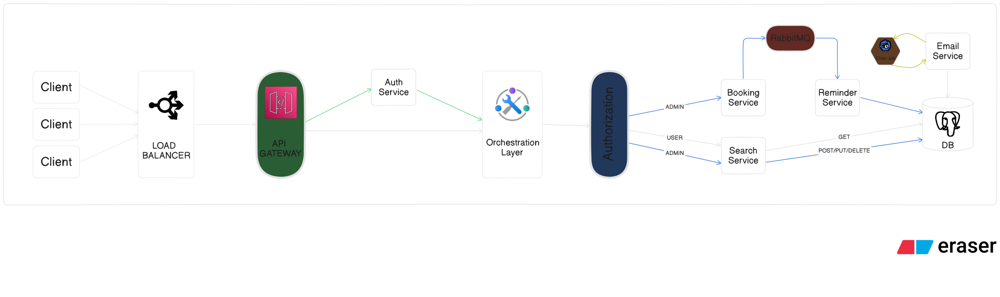

✈️ Airline Flight API Gateway

This is the **API Gateway**, a part of a larger microservice-based architecture designed to support a modular and scalable flight booking platform.

---

## 🧱 Part of a Microservice Architecture

This project is one of several microservices that work together:

- ✈️ [API Gateway](.) _(You are here)_
- 🚪 [Flight Search Service](https://github.com/ANIKETRAJ28/Airline_Flight_Search_Service_TS)
- 🔐 [Auth Service](https://github.com/ANIKETRAJ28/Airline_Auth_Service_TS)
- 🚪 [Booking Service](https://github.com/ANIKETRAJ28/Airline_Booking_Service_TS)
- 🔔 [Reminder Service](https://github.com/ANIKETRAJ28/Airline_Reminder_Service_TS)

## 🛠 Tech Stack

- **Node.js** with **TypeScript**
- **Express.js** for API server
- **PostgreSQL** as the database
- **Node-pg-migrate** for database migrations
- **RabbitMQ** for message brokering
- **Node-cron** for scheduling email reminders
<!-- - **Swagger** for API documentation
- **Jest** for testing -->
<!-- - **Docker** (if used) -->

## Project Setup

### Prerequisites

- Ensure you have **Node.js** and **npm** installed on your machine.
- Set up the following microservices:
  - [Flight Search Service](https://github.com/ANIKETRAJ28/Airline_Flight_Search_Service_TS)
  - [Auth Service](https://github.com/ANIKETRAJ28/Airline_Auth_Service_TS)
  - [Booking Service](https://github.com/ANIKETRAJ28/Airline_Booking_Service_TS)
  - [Reminder Service](https://github.com/ANIKETRAJ28/Airline_Reminder_Service_TS)
- Ensure that the services are running on the specified ports in the `.env` file.

### Clone Project

```bash
git clone https://github.com/ANIKETRAJ28/Airline_Api_Gateway_TS.git
```

### Install Dependencies

```
npm install
```

### Create `.env` file

```bash
touch .env
```

### Add env variables

```bash
AUTH_SERVICE_URL=http://localhost:3050/api/v1
BOOKING_SERVICE_URL=http://localhost:8080/api/v1
SEARCH_SERVICE_URL=http://localhost:5000/api/v1
REMINDER_SERVICE_URL=http://localhost:5050/api/v1
```

## High Level Design



## 🤝 Contributing

Contributions, issues and feature requests are welcome!
Feel free to check the [issues page](../../issues)
